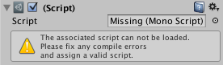

Giacomelli.Unity.EditorToolbox
===========

This editor toolbox is (or will be) a collection of tools to make my life as Unity3d developer easier. I hope it can help others game developers to ;)

--------

##Tools

###Missing scripts resolver

You changed the name of your MonoBehaviour script outside of Unity3d editor or decided to put them to an external dll and now your prefabs are showing the message "Missing (Mono Script). The associate script can not be loaded. Please fix any compile errors and assign a valid script."?

This tool was created to try to resolve this problem. It search for prefabs that has missing scripts and fix them.

--------

Setup
===
Download the latest version of Giacomelli.Unity.EditorToolbox.dll from our [releases page](https://github.com/giacomelli/Giacomelli.Unity.EditorToolbox/releases) and put it anywhere inside Assets folder of your Unity3d project.

Usage
===

The available tools (nowadays just the "Missing script resolver") can be access on menu "Giacomelli".

--------

Roadmap
--------
 - Add more tools (Do you have an idea for a tool? Get in touch [@ogiacomelli](http://twitter.com/ogiacomelli)).
 
--------

FAQ
======

Having troubles? 

- Ask on Twitter [@ogiacomelli](http://twitter.com/ogiacomelli).
- Ask on [Stack Overflow](http://stackoverflow.com/search?q=Giacomelli.Unity.EditorToolbox). 

 --------

How to improve it?
======

Create a fork of [Giacomelli.Unity.EditorToolbox](https://github.com/giacomelli/Giacomelli.Unity.EditorToolbox/fork). 

Did you change it? [Submit a pull request](https://github.com/giacomelli/Giacomelli.Unity.EditorToolbox/pull/new/master).

License
======
Licensed under the The MIT License (MIT).
In others words, you can use this library for developement any kind of software: open source, commercial, proprietary and alien.

